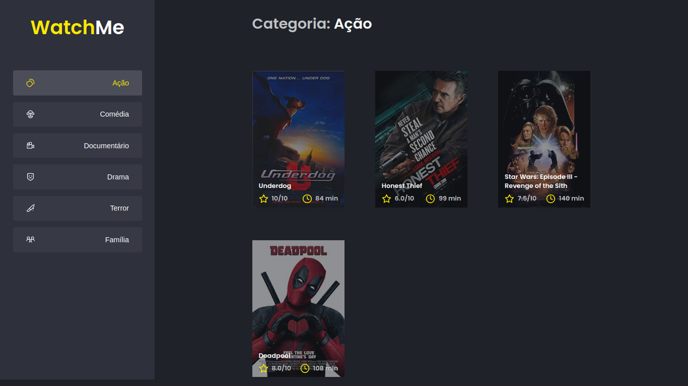

<div align="center">
    
   </br>
</div>
<h1 align="center"> Ignite ReactJS </h1>
<h2 align="center"> Desafio 02 : Componentizando a aplicação ( Projeto WatchMe ) </h2>

<p align="center">
  <a href="https://rocketseat.com.br">
    
  </a>
    <a href="https://www.linkedin.com/in/thiagonovaess/">
    
  </a>
</p>

## 🚀 Sobre o Projeto
Projeto simples construído com ReactJS onde se é consumida uma Fake-API construída através do axios. 
O desafio é efetuar um componentização da aplicação pois todo o código se encontra centralizado no arquivo App.tsx. Será necessário dividir a aplicação em pelo menos duas partes principais: sidebar e o conteúdo principal que possui o header e a listagem de filmes.  

## ⚙️ Rodando o Projeto

```bash
# Abra um terminal e copie este repositório com o comando
git clone https://github.com/nsthiago/reactjs-challenge-02
# ou use a opção de download.

# Entre na pasta da aplicação 
# Instale as dependências
yarn install

# Inicie a Fake API
yarn server

# Rode a aplicação
yarn dev

# Acesse http://localhost:8080 no seu navagador
```
## 🌐 Referências

[Desafio 02 - WatchMe](https://www.notion.so/Desafio-02-Componentizando-a-aplica-o-b9f0f025c95b437699d0c3115f55b0f1) Notion.

<br>

## 📝 Licença

Veja o arquivo [LICENSE](/LICENSE) para mais detalhes.
